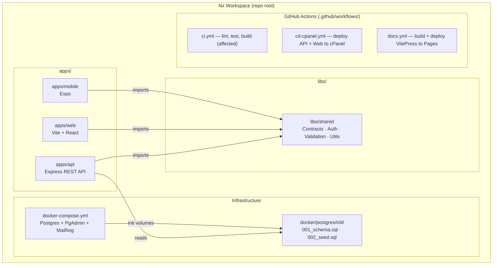
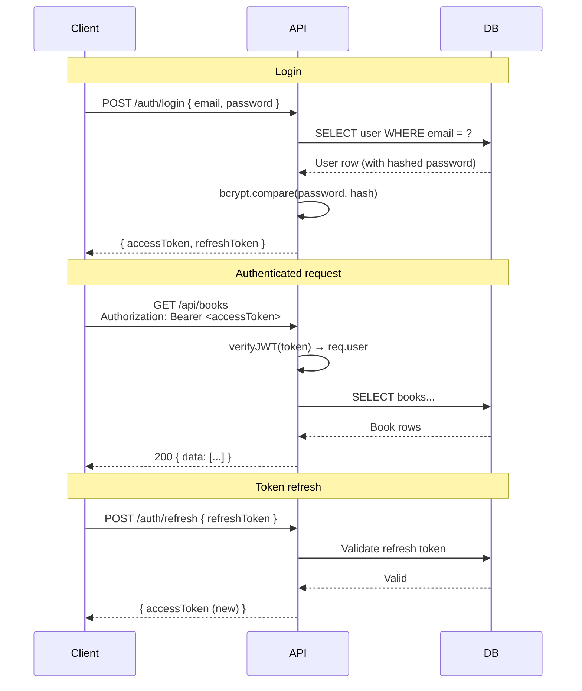
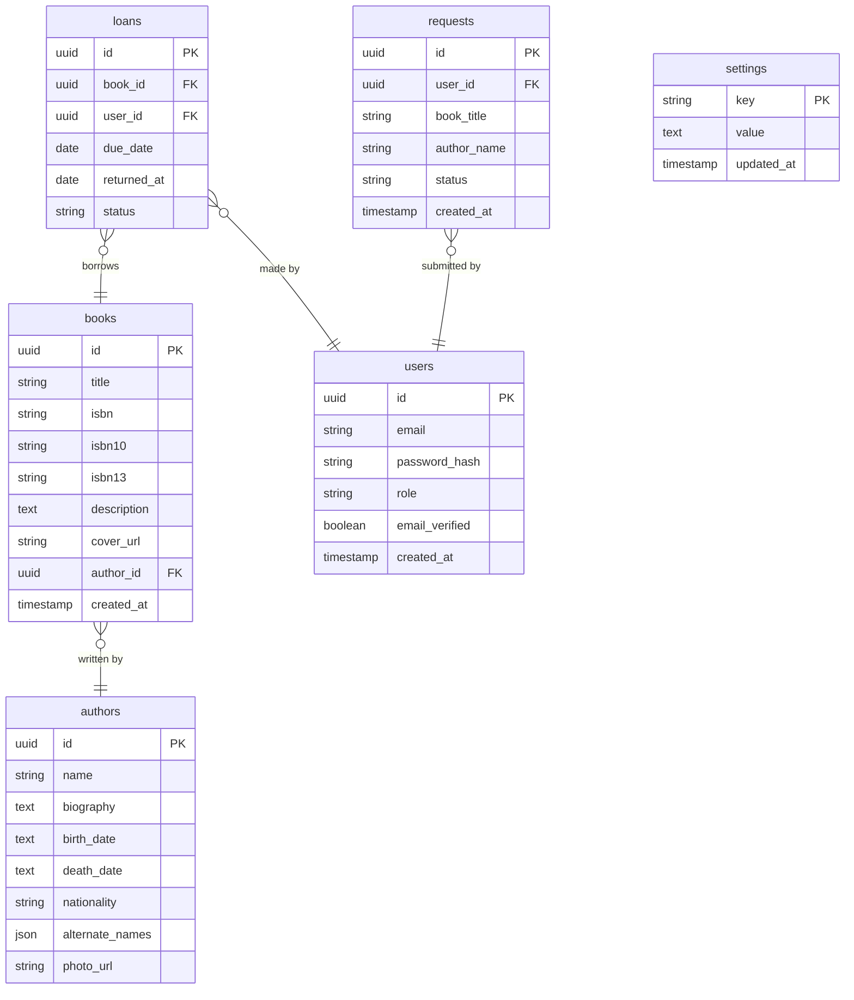

# Architecture

This page describes how Folio's parts fit together, from user interactions down to the database.

---

## System Context

The highest-level view: who uses Folio and what external services it talks to.

---

## Container Diagram

The internal moving parts of Folio and how they communicate.

---

## API Request Flow

How a typical authenticated request moves through the API layers.

---

## Monorepo Structure

How the Nx workspace is organized.

---

## API Internal Layers

The four-layer architecture inside `apps/api`.

---

## Authentication Flow

How users authenticate and how the JWT token is used on subsequent requests.

---

## Data Model (core entities)

Key relationships between the most important tables.

---

## Deployment Topology (production)

How a typical cPanel/shared hosting deployment looks.

---

## Next steps

- [Project Structure](./project-structure) — file-by-file breakdown
- [API Guide](./api-guide) — patterns and conventions in depth
- [Adding Features](./adding-features) — step-by-step feature workflow
