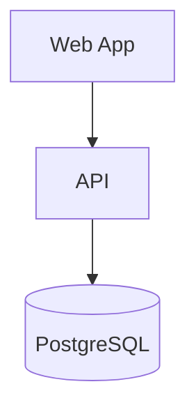

# Docs Contribution Guide

How to write, update, and add media to this documentation site.

---

## How the docs site works

This documentation is built with **VitePress** from Markdown files in `docs-site/`. It is deployed automatically to GitHub Pages when changes land on `main`.

```
docs-site/
├── .vitepress/
│   └── config.ts       # Navigation, theme, and plugin config
├── index.md            # Home page
├── user/               # End-user guide pages
├── dev/                # Developer guide pages
└── public/             # Static assets (images, logos, favicons)
```

---

## Running the docs site locally

```sh
cd docs-site
npm install   # or: yarn install (inside docs-site)
npm run docs:dev
```

Open [http://localhost:5173](http://localhost:5173). Pages hot-reload as you save.

Build and preview the production output:

```sh
npm run docs:build
npm run docs:preview
```

---

## Adding a new page

1. Create a `.md` file in the appropriate folder (`user/` or `dev/`).
2. Add a frontmatter `title`:
   ```md
   ---
   title: My New Page
   ---

   # My New Page
   ```
3. Add the page to the sidebar in `docs-site/.vitepress/config.ts`:
   ```ts
   { text: 'My New Page', link: '/dev/my-new-page' }
   ```
4. Add cross-links from/to related pages.

---

## Writing style

- **Write for the target audience** — each section of `user/` is for non-technical readers; `dev/` is for developers.
- **Short paragraphs** — keep blocks of prose under 5 lines.
- **Use admonitions** for important callouts:

  ```md
  ::: tip
  Helpful tip here.
  :::

  ::: warning
  Something that could cause data loss.
  :::

  ::: info Library profile required
  Feature only available in Library mode.
  :::
  ```

- **Use tables** for structured comparisons.
- **Use code blocks** with language hints for all code and terminal commands.

---

## Adding images

### Folder conventions

Store images in `docs-site/public/images/`:

```
docs-site/public/
└── images/
    ├── user/            # Screenshots for the User Guide
    ├── dev/             # Diagrams and screenshots for the Dev Guide
    └── shared/          # Shared assets (logos, etc.)
```

### Naming convention

```
<page-slug>-<description>-<variant>.png
```

Examples:

- `first-use-login-screen.png`
- `admin-settings-profile-presets.png`
- `architecture-container-diagram.png`

### Format guidelines

| Type                  | Format                | Max size | Notes                                           |
| --------------------- | --------------------- | -------- | ----------------------------------------------- |
| Screenshots           | PNG                   | 1 MB     | Crop tightly, no personal data                  |
| Animated walkthroughs | GIF or WebP animated  | 5 MB     | Keep under 30 seconds                           |
| Diagrams              | SVG or PNG            | 500 KB   | SVG preferred for crisp rendering               |
| Video demos           | MP4 (link externally) | n/a      | Link to YouTube/Vimeo, don't commit video files |

### Inserting images

```md

```

Add alt text for every image. For complex diagrams, add a brief description after the image:

```md


_The web and mobile apps both communicate with the REST API. The API is the only service that writes to PostgreSQL._
```

---

## Adding architecture diagrams

Mermaid diagrams are embedded directly in Markdown and rendered by the VitePress Mermaid plugin. Prefer Mermaid over static images for diagrams that may change with the codebase.

````md

````

If you need a diagram format that Mermaid doesn't support well (e.g. pixel-art mockup, annotated screenshot), use a PNG/SVG in `docs-site/public/images/dev/`.

---

## Adding animated GIFs/screencasts

1. Record the workflow using a screen recorder (e.g. LICEcap, ScreenToGif on Windows; Kap on Mac).
2. Crop to show only the relevant UI area.
3. Keep the clip under 30 seconds.
4. Export at **2x speed** for short demos so they don't feel slow.
5. Save as `.gif` in `docs-site/public/images/user/` or `dev/`.
6. File size must be under **5 MB**. Use an optimizer (e.g. `gifsicle`) if needed:
   ```sh
   gifsicle --optimize=3 --lossy=80 input.gif -o output.gif
   ```
7. Embed with a descriptive alt text:
   ```md
   
   ```

---

## Updating existing docs

When a code or behavior change lands:

| Changed               | Update                                                   |
| --------------------- | -------------------------------------------------------- |
| New API endpoint      | `docs-site/dev/api-guide.md` + Swagger                   |
| DB schema changed     | `docs-site/dev/database.md`                              |
| New env variable      | `docs-site/dev/env-config.md`                            |
| New feature in UI     | Relevant page in `docs-site/user/`                       |
| New deployment option | `docs-site/dev/deployment.md`                            |
| Architecture changed  | `docs-site/dev/architecture.md` (update Mermaid diagram) |

---

## Docs PR checklist

- [ ] New pages added to the sidebar in `config.ts`
- [ ] Cross-links added to/from related pages
- [ ] Images follow naming conventions and are in `public/images/`
- [ ] All images have alt text
- [ ] GIFs are under 5 MB
- [ ] Mermaid diagrams render locally (`npm run docs:dev`)
- [ ] `npm run docs:build` succeeds with no errors

---

[Contributing Code →](./contributing)
